# Sigma-Web-Dev-Course
This repo is for adding source code for Sigma Web Development Course

## Day2
1. create index.html
2. create script.js
3. create style.css
4. load index.html in browser
5. add body in style.css
    body{
    background-color: red;
    color: white;
   }
6. To link css with html to show the background color and text color, add the link tag in head
    <link rel="stylesheet" href="style.css">
7. In script.js, add an alert
    alert("Welcome to Sigma Web Development Course")
8. Link js with html by adding script tag inside body
    

## Day 3
Html has 2 kind of tags -
1. Meta - self closing tag {meta charset="UTF-8"}
2. body, head etc - Pair tags which need to be closed

## Day 4
Heading, Paragraph, Anchor tags and Links

Heading - use alt+shift+down arrow to copy above line and use alt and click sections in line as needed to update all lines together.

My Bookmarks - Learning

Main Bookmarks - Learning

Secondary Bookmarks - Learning

## Day 5
Image, List and Tables
body

    img src="image.png" alt="Train image"
    img width="230" height="230" src="image.png" alt="Train image"

    <table>

        <tr>

            <th>Train Name</th>

            <th>Train Number</th>

            <th>Train Type</th>

            <th>Train Route</th>

        </tr>

        <tr>

            <td>Shatabdi Express</td>

            <td>12002</td>

            <td>Superfast</td>

            <td>Delhi to Mumbai</td>

        </td>

    </table>

    <ul>

        <li>Shatabdi Express</li>

        <li>12002</li>

        <li>Superfast</li>

        <li>Delhi to Mumbai</li>

    </ul>

    <ol>

        <li>Shatabdi Express</li>

        <li>12002</li>

        <li>Superfast</li>

        <li>Delhi to Mumbai</li>

    </ol>

body

## Day 6 - SEO and Core Web Vitals in HTML

SEO - search engine optimization - Google ranks pages based on vitals after content which is the main component used by search engines. In case 2 web sites have same content then vitals help in ranking
Important Vitals
CLS - Cumulative layout shift (How much the page shifts while loading contents)
LCP - Largest contentful paint (how much time does the biggest element in page take to load)
FID - First input delay (Any input from user gets processed in how much time)

Lighthouse in browser can give a vitals report

Analyze in lighthouse for index.html

## Day 7 - Forms and Input tags
form action = post
Div, textbox, checkbox, radiobutton
textarea, options

## Day 8 - Inline and Block Elements
div, paragraph are block
span and anchor are inline

## Day 9 - Id and Classes in HTML
ID = Identity which is always unique
Class = Helps in classifying, same element can have multiple classes and same class can have multiple elements
Id and class are attributes for elements Div, span etc. elements in html
Id is also used for linking by using #id in the URL

## Day 10 - Audio, Video and Media in HTML
video src = "video.mp4" controls autoplay
autoplay,muted,loop, poster or thumbnail are some of the controls for video
Audio also has the same set of controls
Preload - none, auto,meta
svg image
iframe

## Day 11 - Semantic tags in HTML
Important for SEO
These tags help browsers and search engines about the content type and purpose. Also helps with accessibility.
If we do not use this also, it should not impact, just we want to make search engines better
header, footer, nav, article, section, aside, figure, main, time

## Day 12 - Exercise

you have 12 files ; 6 audio and 6 video
Design a website using HTML only which shows these 12 files
1.mp3, 2.mp3 .... 6.mp3
1.mp4, 2.mp4 .... 6.mp4
Use div to show all audio and use div to show all video
paragraph or list way is also OK

## Day 13 - Entities, Code tag and more
Entities are mainly meant for escaping html syntax
&lt;
&gt;
&npsp;
<pre></pre>
<backquote></backquote>
<code></code>
Canvas

## Day 14 - CSS - cascading style sheets
Selector
 #<title>CSS</title>
  # 

## Day 15 - Inline, Internal and External CSS
Inline - <h1 style="color: yellow;background-color: red">Great learning</h1>
Avoid using it

Internal -<h2> Inrternal CSS</h2> -------> body
head ------ 

    We can do bulk edits here as compared to inline css. We need external css as we do not want too much css in html file if our program grows
Less change and small files
External - 

Production application

## Day 17 - CSS Selectors MasterClass
Element Selector - All elements like div, h1, h2 etc get the same css applied
Better to use Class Selectors, id selectors
Class Selector - instead of element, uses class. Ex - red
 .red{
            color: blue
        }
    </style>
</head>
<body>
    

        I am a div
    

Id selector
#green{
            color: green;
        }

         

        I am another div
    

Child Selector
div > p{
    color: x;
    background-color: xx;
}
Descendant Selector
div  p{
    color: x;
    background-color: xx;
}

Universal Selector
*{
    margin:0;
    padding: 0;
}

Pseudo Selector
    a:visited{
            color: red;
        }
        a:link{
            color: greenyellow;
        }
        a:active{
            background-color: purple;
        }
        div:hover{
            background-color: blue;
        }

    
https://www.youtube.com/redirect?event=video_description&redir_token=QUFFLUhqbTVoYmVIdWxTS2pkczEzQW5pR19aT2NoekhKUXxBQ3Jtc0trSEk3eTVxajM3cGFuallpRGNYZEYtektvMDhRTjVHNThTMTJrOTY4RVdRQVBCT25vMHo4V2FQX1o4alV2ME5FWEZMZWd6VmttNkxxM2RuSTBYWnZ1bEl2WmJJa0ZENXB1Mzh6T0RReW9jV3Y0aHozWQ&q=https%3A%2F%2Fweb.dev%2Flearn%2Fcss%2Fpseudo-classes&v=1cEG1T8beO4

## Day 18 - CSS Box Model - Margin, Padding & Borders
Everything is a box in CSS
Outside your content, we have padding and then margin and then border
if we have height as 200 and then we also mention box size, the the height 200 will be padding+border+height = 200, else 200

Margin Collapse -
if we have 2 boxes with same margin then the gap between boxes is applied once as per margin and if margin is 30 and 20 for boxes respectively then 30px is the gap between box1 and box2

## Day 19 - CSS Fonts, text and color properties
  p{
            font-family: 'Courier New', Courier, monospace;
            font-style: italic;
            font-weight: bold;
        }
        h1{
            font-family: 'Times New Roman', Times, serif;
        }

we can also import font family in to our style tags from google with the URL for fonts or get the exact way to use it by using font-family declaration.
Explore in google fonts

font-size: 

check default font-size by doing F12-> Computed, it would show 32px for h1
font-family: 'Courier New', Courier, monospace;
            /*font-style: italic;
            font-weight: bold;*/
            font-size: 20px;
            line-height: 4;
            letter-spacing

Text properties
               text-transform: uppercase;
            text-decoration: underline;
            text-decoration-color: red;
            text-decoration-style: dotted
        }
        text-decoration-thickness:7px
        text-indent:
        text-overflow: clip or ellipses
        text-align: center

Color properties
Available colors in css can be found at https://codepen.io/web-dot-dev/pen/ZELGraM
Ways to show color -
1. Color keywords
2. Hex Color code
3. RGB - A is alpha which is for opacity
4. RGBA
5. HSL - ghue, saturation, lightness
 /*color: red*/
            /*color: #0BEE0B;*/
            /*color: rgb(114, 156, 55);*/
            color: rgba(156, 97, 55, 0.336);
            color: hsl(120, 100%, 50%);

## Day 20 - Exercise

## Day 21 - CSS Sprcificity & Cascade
Assume that we have an element that has been styled in 2 ways through CSS. So, we have used 2 types of selectors to style it.
1. Universal
2. h1 class
Example

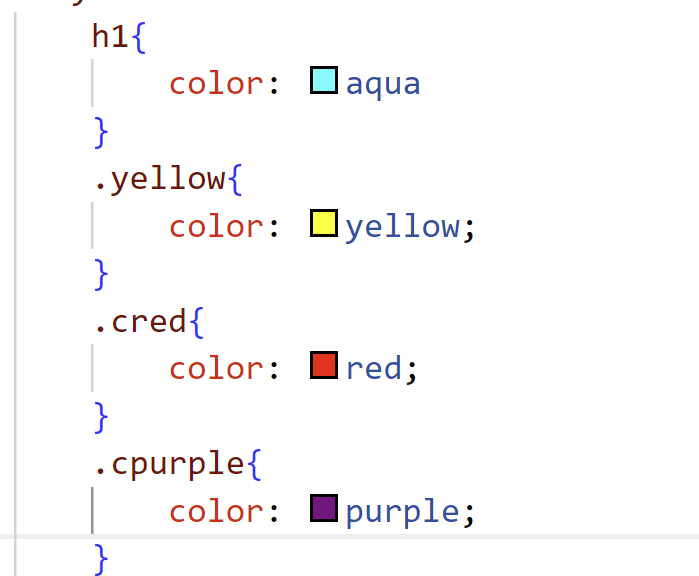

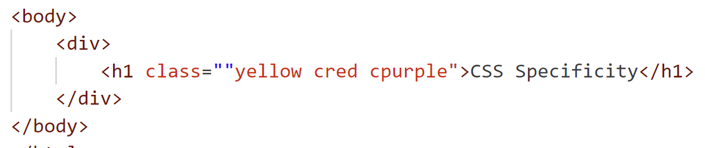
How would we ensure which one gets applied? This is where specificity plays a role and we would see the rules.
CSS has cascade algorithm which helps in deciding.
All class selectors will have same priority and the last one would get applied

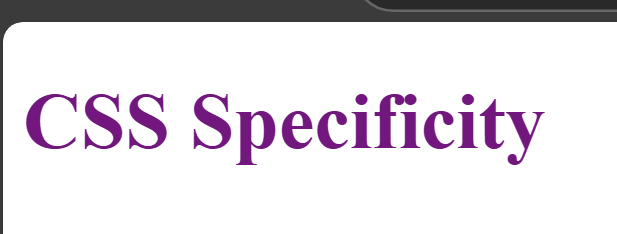

In case we use different selectors, which one gets applied in that case?
It is based on specificity, which selector is more specific?
inline is considered as highest priority.
Then it's id selector which is taken as next highest priority
Then class or attribute selector, then element and then universal

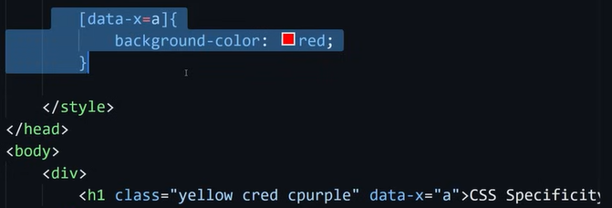

Inline > ID> Class or Attribute > Element > Universal

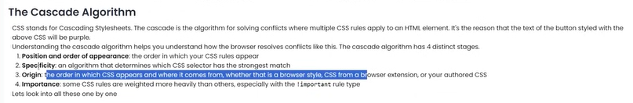

For overriding inline style, we add !important, then this would apply.

How to calculate specificity?

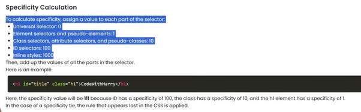

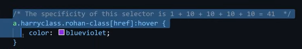
a is element, specificity =1
harryclass = 10
rohan-class = 10
href is attribute selector = 10
hover is pseudo class = 10

## Day 22 - CSS Sizing Units - px, rem, em, vh, vw, % and more

   container{
        box-sizing: border-box;
        border: 2px solid black;
        /*width: 2048px; *//*width of the box in pixel*/
       /* width: 100vw; *//*width of the box in pixel*/
       width: 80vw;
       margin: 23px auto;
        background-color: aquamarine;
        height: 80vh;
    }

vh, vw, px, rem (root element), em (parent element)

container{
        box-sizing: border-box;
        border: 2px solid black;
        /*width: 2048px; *//*width of the box in pixel*/
       /* width: 100vw; *//*width of the box in pixel*/
       width: 80vw;
       margin: 23px auto;
        background-color: aquamarine;
        height: 80vh;
        font-size: 18px;
    }
    .container p{
        font-size: 2rem;
    }

vmin, vmax - depends on the device orientation
min-height

% - not used at all places. vh and vw are used in most cases. where parent's width is set then use %

## Day 23 CSS Display Property
what is display property and how to change it using css?
in html we have inline and block elements.
For div with class box, its a block element but to make it inline we have to put inline in css box class
With inline margin, padding does not apply on the top and hence we have to use display: inline-block

Display:none -- to remove the element from display completely
visibility: hidden - space will remain in page but the element will be hidden

Flexbox - 
display:flex;
justify-content: center;
inline-flex brings all elements in sameline

Grid - also a display property

## Day 24 CSS Shadows and Outlines
How to give shadows and outliers?
box shadow
 .box{
            border: 2px solid black;
            padding: 34px;
            box-shadow: 5px 15px 5px #70a711;
        }
    </style>
</head>
<body>
    

        I am a box
    

text-shadow

        .box{
            border: 2px solid black;
            padding: 34px;
            box-shadow: 5px 15px 5px #70a711;
        }
        .text-element{
            text-shadow: 2px 2px 2px #ff0000;
        }
    

    div class="box"
        I am a box
    /div>
    p class="text-element"
        Lorem ipsum dolor sit amet consectetur adipisicing elit. Eius earum itaque velit incidunt quod, blanditiis, optio, totam voluptatum minus doloribus dolore modi deleniti?
    /p

border, outline and outline-offset
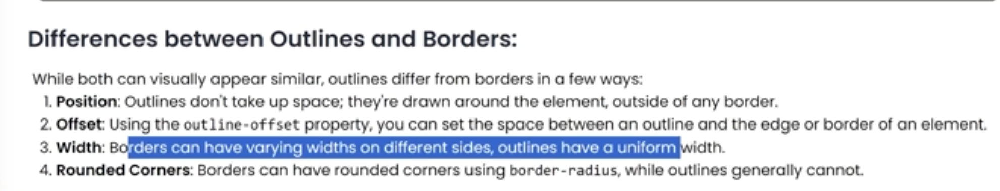

## Day 25 Styling lists using CSS
How to style lists - ol and ul?
 nav ul li{
            list-style: devanagari;
            list-style-type:"१"; 
            background-color: bisque;
            list-style-position: inside;
            border: 2px solid black;
        }
     nav
        ul
            li>Homeli
            li>Aboutli
            li>Contactli
        ul
    nav   

    /* list-style: devanagari; */
    /* list-style-type: "१"; */
    /* background-color: bisque; */
    /* list-style-position: inside; */
    /* border: 2px solid black;

    Apply the following
        list-style: none; in li
        padding: 23px; in li

        and display: flex in ul

        we get horizontal nav bar

## Day 26 CSS Overflow property
we have a box and content is more than the box can handle, then overflow happens.
            width: 20vw;
            height: 10vh;
            border: 2px solid black;
            overflow: scroll;

overflow can be auto for detecting if a scroll is needed then it would show.

white-space: nowrap; - keeps horizontal scroll
text-overflow: ellipsis; - adds ellipsis in text
overflow-x:hide;
overflow-y:auto
overflow: scroll hidden - for x and y together

## Day 27 Exercise 20 solution
  p
            background-color: blue;
            color: white;
        
        div p:first-child
            background-color: yellow;
            color: red;
        
        /* Here if we want to not give any style for paragraph first then we can give the following style
        div p:not(:first-child){
            background-color: blue;
            color: white;
        } */

## Day 28 CSS position property
Position is static by default and we cannot use top, left or right with this as it won't make any changes.
To make use of top, letf, right or z-index, we use 
position:relative;

position:absolute; - box or any other element searches for nearest parent which is positioned and then aligns based on the parent.
position:fixed; - element gets fixed and does not move even if we scroll down or up
position:sticky; - it sticks to a position and all other elements would be aligning based on this element, eg- while we scroll.
transform, filter or perspective properties can also make an element appear as positioned
transform: translate(0);
filter:invert(0);
perspective:0em;

## Day 29 - Exercise 3
Solve 

## Day 30 CSS Variables
we can declare variables in css and use it in various classes by declaring
root variables
 :root
            --color: blue;
            --seccolor: rgb(131, 114, 151);
            --defpad: 34px;
        
Usage
   .nav
            /*background-color: aqua;*/
            background-color: var(--color);
        
        ul
            display: flex;
        
        ul li
            list-style: none;
            padding: var(--defpad);
            border: 2px solid var(--seccolor);
        
        ul li:first-child
            --color: rgba(156, 151, 101, 0.5);
            background-color: var(--color);
        
        .container
           /* background-color: burlywood;*/
              background-color: var(--seccolor);

we can store any properties in variables and then call that variable. example - color, padding, opacity etc.

## Day 31 CSS Media Queries

Media Queries are helpful in making our websites responsive for any devices.
Examples
 media screen and (orientation: landscape){
            body{
                border: 2px solid purple;
            }
        }
        media only screen and (max-width: 455px){
            body{
                background-color: red;
            }

## Day 32 - Exercise 3 Solution
Solution available in Day 32 folder

## Day 33 - Exercise 4
Multi Color Website
Design a navbar and after that make a stylesheet where on changing a variable, the color contrast should change. So, we need to do a
multicolor navbar using css variables.

## Day 34 - CSS Float and Clear
Float and clear are less used since Flex has been introduced but it is important to understand what they are.
float: left or right -> puts an image or content on left or right
clear: will not allow the image to show up in the right or left if given clear:both
Not recommended for use bot clear and float for modern websites. Flexbox is used.
Overflow can be removed by using display: flow-root. There are other ways as well.

## Day 35 - More on Selectors
 /* .box:first-child
            background-color: red;
        
       /* .box::first-line
            color:yellowgreen
        
        apply inside boxes
        .boxes *
            color: blue;
            border: 2px solid red;
        
        attribute selector and grouping of selectors
        p, a, .box, [data-color="primary"]
            background-color: yellow;
         .box:nth-child(odd)
            background-color: yellow;

        .box:nth-last-child(1)
            background-color: yellow;
        
        .boxes::after
            content: "I am after content";
            color: blue;
         .boxes::before
            content: "I am before content";
            color: red;

        selection{
            background-color: yellow;
        box::first-letter{
            color: peru;
            
        input::placeholder
            color: rgb(138, 142, 154);
            font-size: 20px;
        
## Day 36 - Exercise Day 33 Solution
Create a multicolor website which can change color using CSS variables
solution available in Day 36 folder

## Day 37 - Exercise
Design Layout
Screen -> Navbar
2 boxes below navbar with background color in main box and the 2 boxes
1 rectangle with text - Welcome to this Express Course
below this put an icon
when you scroll, the icon and nav bar should remain in their positions
Footer
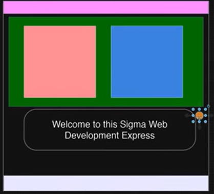

## Day 38 - CSS Flexbox
History - Earlier we were using float, position and it was difficult to bring a div at the center for devs, hence we needed a mechanism to have content at the sides and center in the layout. So, flexbox was added.
display flex means now we can use the properties of flexbox
It aligns elements from left to right by default.
bring items to center by using justify-content:center
To bring items vertically center - use align-item: center
Most of the times, above is used in projects
flex-end - takes elements to end, there are other properties in justify-content
Changing align-items - flex-start, flex-end, center etc.

Concepts -
1. Flex direction - by default left to right
2. can be changes to top to bottom
for arranging items in columns - we use Flex-direction: column
justify-content: center brings items to center based on main axis
we have main-start, main-end in case of left to right (row) and top to bottom (column)

Flex-Wrap : when we give lots of elements it would lead to overflow, flex-wrap helps in wrapping the content to below row or another column.
align-content: center is used when we have multiple lines in row when items are wrapped.
align-item is used when we have only one line.
It is important to understand the container properties and item properties. All above were container properties
Item properties are -
order
default order is 0 and higher order comes at the end
flex-grow
flex-shrink
align-self - owberwrite particular item alignment

## Day 39 - CSS Grid
One of the ways to make a layout as floats and positioning are confusing and there are scenarios where css grid can be directly applied.
display: grid
and then we can define the number of col and rows
Grid line is all line which are there based on the number of cells
Grid cell - one cell in the grid
Grid Track - space between 2 grid lines
Grid Area - any area inside the grid, if we take 2 lines in horizontal and 2 lines in vertical, its called grid area

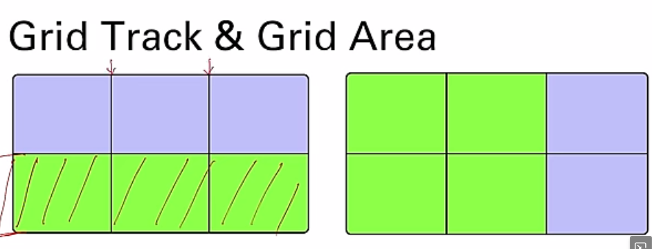

Grid lines are numbered. and we can also give names instead of numbers if needed

Another way to use Grids is via Grid Template Areas by naming
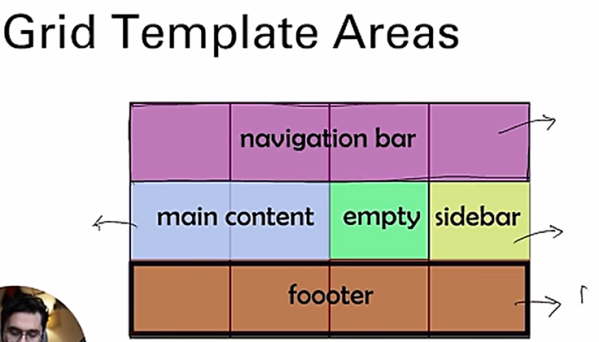

frunit - fr is a unit which is used in grid. Instead of px we can use fr
which means if width is 80vw, then 1fr 1fr 1fr would divide the available width as 1/3 for each portion.
gap - creates gaps in the grids for row and col
justify-items:center
align-items: center ----> needs height to be declared
minmax
place-content: center puts all the grids in center (works as both justify and align content)
justify-content (width), align-content (height) is applicable when container is larger than the grid and then grid moves
if we want to move content within cells, then use align-items, justify-items

## Day 40 - Exercise Day 37 sol
solution available in Day 40 folder

## Day 41 - Exercise 6 using Flexbox
Design website Navbar using Flexbox from UltraEdit website

## Day 42 - CSS transforms masterclass
1. 2D Transforms - inc scale, translate, rotate, 
2. 3D Transforms

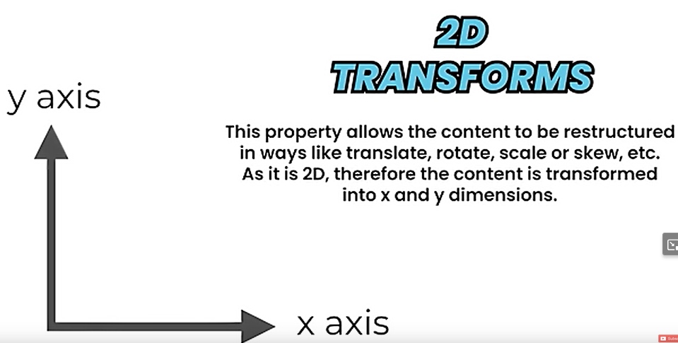

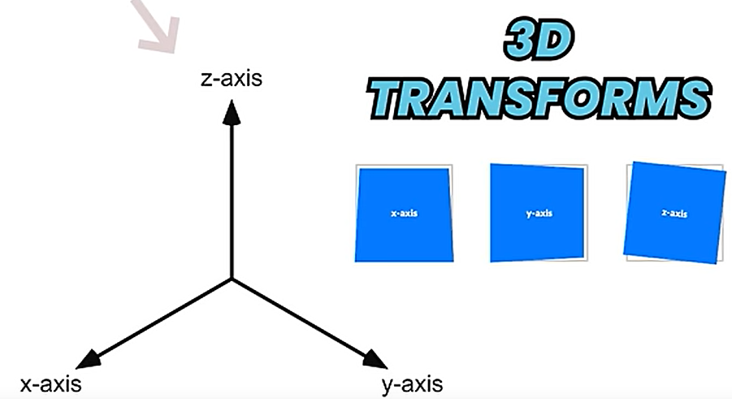

            /*transform: rotate(45deg);*/
           /* transform: rotate(0.25turn);*/
            transform: rotateZ(95deg);
            transform: scale(1.6)
            transform: scaleY(1.6)
            transform: scale3d(1.6)
            transform: skew(5deg) -> skew cannot happen in Zaxis
            transform: translateX(10%)
            transform: translateY(10%)
            transform-origin: -(0 -0) use along with transform: rotate(30deg)

## Day 43 - Solution for Exercise 6 - Navbar using flexbox
solution available in Day 43 folder

## Day 44 - Design the Grid Exercise
   <!-- Design the body of this website
     https://www.ultraedit.com/downloads/ultraedit-download-thank-you/-->
     Design using CSS Grid

## Day 45 - CSS Transition Property

Moving from one property to another smoothly is done by transition.
we click on side bar, is it better if side bar loads smoothly or just like that. This is where CSS transition is used

if we put the following for a box in a container, the translation happens but it is not smooth. So, we are going to make it smooth.
translate{
            transform: translateX(50%) translateY(50%)
        }

so, we will use transition which is made up of 4 properties.
transition-property
transition-duration
transition-timing-function
transition-delay

transition-property: transform; or use all
            transition-duration: 3s;
            transition-timing-function: ease-in-out;
            transition-delay: 1s;

we can also use - transition: all 3s ease-in-out 1s; this includes all properties at once

## Day 46 - CSS Animations

Similar to transitions but it helps in changing more properties and when and how properties can be used
For animations - we use key frames

.box{
            background-color: aqua;
            height: 45px;
            width: 34px;
            animation: name duration timing-function delay iteration-count direction fill-mode;
        }
        @keyframes deepakKaAnimation{
            from{

            }
            to{
                transform: translateX(1000px)
            }
        }

For simple functionality - use transitions. Animations can be used for complex or repeatable activities

we can give properties one by one or we can also give in the following way -
animation: name duration timing-function delay iteration-count direction fill-mode;

animation: fill-mode - used for animations which are repeatable
animation-fill-mode: backwards; - repeats as needed and then retains the form

We can use one animation to animate multiple properties. Multiple animations can also be used

## Day 47 - Exercise Day 44 solution
Using grid to design ultraedit website body

## Day 48 - Exercise 
Use animation or transition to bounce the red ball

## Day 49 - CSS Object-fit and Object-cover
sometimes we have to keep an image inside a container so that the aspect ratio is maintained and image completely fits
in the container
So, we use Object-fit and Object-cover
object-fit: contain or cover - helps to contain an image in a box but truncates to manage aspect ratio
if we want to truncate a selected part then we have to give object-position
object-position: top right -> shows everything available in top right and cuts other positions.

We have an option to give background-image in container instead of giving the image in the body.
background-position
background-repeat
background-clip

## Day 50 - CSS Filters
Brightness, contrast, inverting an image are some of CSS filters

      img{
            filter:blur(5px);
        }
        .img1{
            filter: brightness(60%);
        }
        .img2{
            filter: brightness(150%);
        }
        .img3{
            filter: contrast(250%);
            filter: grayscale(100%);
        }

## Day 51 - Exercise Day 48 solution
solution is in Day 51

## Day 52 - Figma basics

## Day 53 - Netflix clone project
Dev in progress in Day 53

## Day 54 - Javascript Introduction
how to call JS from html
script src="script.js"

## Day 55 - JS variables, data types and objects
var, let , const

Var should not be used always and we use let
variables are case sensitive
var x
var y
var 55a -> is not possible

var is globally scoped while let and const are block scoped
const cannot be changed once declared

Objects and Primitive data types
primitive data types - Null, Number, String, Symbol, Undefined, Boolean, BigInt
typeof null is a object as it's declared as object when JS started and there are lots of dependencies on this, hence it was never changed to null.

Object - key/value pair combination
let o = {
    "name": "X";
    "job code": 200
}

## Day 56 - JS conditionals
== -> checks value
=== -> checks type and value
? -> ternary operator
Multiline comment  /* */ or // -> select ctrl and fwd slash for a number of rows in vs code
if
else if
else

a = 15;
 b = 6;
let c = a>b ? (a-b) : (b-a);
console.log(c);

/* translates to
 if (a>b){
    let c = a+b;
 }
 else{
    let c = a-b;
 }
 */

 ## Day 57 - JS loops
 Automate repeatitive tasks
 for, forin, forof, while, dowhile

 ## Day 58 - JS Functions
 When we have repeatitive code, then we package code in functions. We can also pass arguments with the help of functions.
 pass arguments
 return result
 if we pass undefined in arguments, we get NAN in result. NAN is not a number
 arrow function

 function invocation or execution

 ## Day 59 - Exercise
 Make a faulty calculator

This faulty calculator does the following -
1. It takes 2 numbers as input from user
2. It persorms wrong operatios as follows -
+ -> -
* -> +
- -> /
/ -> **

It performs wrong operations 10% of the times

## Day 60 - JS Strings
string - uppercase, lower case
find particular character occurence
array index out of biunds is shown as Undefined here. so its called a forgiving language. if we miss ";", then also it does not error out.
Template literal
Escape sequence \n \t
Strings are immutable. string cannot be changed when already declared in memory. Always new strings are created
charAt()
indexOf()
toUpper()
toLower()
slice()
startsWith()
endsWith()

## Day 61 - solution of Day 59
we can use ${eval('${a} ${c} ${b}')}
available in Day 61 folder

## Day 62 - Exercise - Business Name generator
Create a business name generator by combining list of adjectives and shop name and another word
Adjectives
crazy
amazing
fire

shop name:
Engine
Foods
Garments

Another Word:
Bros
Limited
Hub
Example - crazy engine hub

do not use arrays

## Day 63 - Javascript Arrays
store multiple values under one variable
add elements to array which changes the length of the array
print specific values of array. arr[2]
We can also change values at specific index in an array but in case of strings we cannot do this as strings are immutable
Arrays are mutable and they have lots of methods.
typeof array is object
arr.pop(2) -> pops out second index element
arr.shift() removes element in front
delete deletes the specific index element
concat() concatenates arrays
arr.concat(a1,a2) -> returns a new array
sort() -> sorts
splice(1,3,222,333) -> helps to remove 1 and 2 index and add 222 and 333to the array in these indexes
slice() -> slices out a piece from an array
reversearray

for
foreach
forin
forof
map
reduce
filter
Array.from("Test")

## Day 64 - solution for Day 62 exercise
Available in folder 64
use if and else with random for soncatenating the 3 names
use object for production grade solution where we can use keys and values 

## Day 65 Exercise
Write a program to calculate factorial of a number using reduce and for loops
6! = 6*5*4*3*2*1
use for and reduce

## Day 66 - Document Object Model in JS
Tree like structure representation for JS Dom and advantages of the same
DOM - Document object Model
BOM - Browser object Model
Window is the global object which has DOM, BOM and Javascript core
This helps us to target elements using javascript and then perform any actions
DOM - Mapping of the entire document in to an object which gives you all the content of the page. DOM represents the page content as Html.
BOM - Apart from document if we have to work with any other elements then BOM provides the additional objects to be used.

window
Window {window: Window, self: Window, document: document, name: '', location: Location, …}
window.document - gives the document
window.document.body - gives the body
select any element in the page and try to do a $0 in console, you will be able to refer the object. This is from BOM
$0.style.backgroundColor = "green"

Document -> Root Element
Root Element -> Element Head, Element body
Element Head -> Element Title -> Title
Element body -> Element h1 -> text, Element p->text

## Day 67 - JS Dom - Children, parent and Sibling nodes
we will check how to addess nodes, parents and siblings and how to access and change styles of these elements.

firstchild

lastchild

childnodes

document.body

document.body.chileNodes - NodeList(9) [text, div.container, text, script, text, comment, text, script, text]
document.body.childNodes[1].childNodes

NodeList(11) [text, div.box, text, div.box, text, div.box, text, div.box, text, div.box, text]

let cont = document.body.childNodes[1]
undefined
cont

​…​
​
cont.firstChild
#text
cont.firstElementChild

​Box1​
​

parent node

let cont = document.body.childNodes[1]
undefined
cont.lastElementChild.parentElement

​…​
​

PreviousElementsibling or PreviousSibling

child nodes of first element child

document.body.firstElementChild

​…​
​
document.body.firstChild.childNodes
NodeList []
document.body.firstElementChild.childNodes
NodeList(11) [text, div.box, text, div.box, text, div.box, text, div.box, text, div.box, text]

if we need only elements

document.body.firstElementChild

​…​
​
document.body.firstElementChild.children
HTMLCollection(5) [div.box, div.box, div.box, div.box, div.box]

if we have a table then we can do the following

document.body.childred[index]

then get all details regarding tables

 table.rows

## Day 68 - JS - select by Ids, classes and more

In JS, there are meny methods to search the DOM, like 

getelementbyID()

ElementbyclassName()

document.querySelector()

apply changes by class

let boxes = document.getElementsByClassName("box");
console.log(boxes);

boxes[2].style.backgroundColor = "red";

Now, apply changes by using id in html

 div id = "redbox" class="box">Deepak Mishra 

document.getElementById("redbox").style.backgroundColor = "red";

DOM elements are mostly used when the elements are closer to each other in the page like parent, sibling, child etc.

id is always unique

we can also use query selector to get the same background color for a box

document.querySelector(".box").style.backgroundColor = "green";

only matches the first selector and makes it green. if we want all boxes to be green then in that case -

document.querySelectorAll(".box") -> returns a html collection when we do console log and we cannot do a .style.background Color to set all boxes green as htmlcollection.style is not a valid one.

So, use for loop to access all the elements in the html collection

document.querySelectorAll(".box").forEach(e=>{
   e.style.backgroundColor = "green";

Get elements by tag name

document.getElementsByTagName("div")
HTMLCollection(7) [div.container, div.box, div.box, div.box, div#redbox.box, div.box, div.box, redbox: div#redbox.box]

Matches - returns if class or id matches for the element

Closest - checks parent or child and outputs nearest match

Contains

document.querySelector("body").contains(document.querySelector("container"))
false

document.querySelector("body").contains(document.querySelector(".container"))
true

## Javascript - Day 69, solving Day 65 exercise

Factorial problem solved in Day 69 folder

## Javascript - Day 70 Exercise

Given 5 boxes, assign a random background color to each box using Dom concepts

## Day 71 - Inserting and Removing elements from DOM using Javascript
This is useful while making single page applications or we want the work to be done without loading the page.

document.querySelector(".box")

​ Hey I am a Box ​
​
document.querySelector(".box").innerHTML
'\n            Hey I am a Box\n        '

document.querySelector(".container").innerHTML
'\n        
\n            Hey I am a Box\n        
\n        
i am box2
\n    '

document.querySelector(".container").innerText
'Hey I am a Box\ni am box2'

 outer html - we get the container and whatever is inside container

 document.querySelector(".container").outerHTML
'
\n        
\n            Hey I am a Box\n        
\n        
i am box2
\n    
'

 document.querySelector(".container").tagName
'DIV'

tagName is used for Element and NodeName is used for any node like coment node or text node.

document.querySelector(".container").textContent
'\n        \n            Hey I am a Box\n        \n        i am box2\n    '

hasAttribute

hidden

getAttribute

attributes - gives all attributes

removeAttributes - removes Attributes mentioned in ()

document.designMode=on, use this to make any changes to the website

Data Attributes

data-createdby="Deep"

document.querySelector(".box").dataset

Insertion Methods in node

node.append()

prepend

before

after

Insert adjacent HTML/Text/Element

insertAdjacentHTML("afterend","<b>i am inserted after end </b>")
beforebegin
beforeend
afterbegin

Node Removal

ClassName and classList

document.querySelector(".container").classList
DOMTokenList ['container', value: 'container']

document.querySelector(".container").className
'container'

classList.add

classList.remove

classList.toggle()

## Day 72 - Solution for Exercise Day 70

Available in folder Day 72
done for generating random number from 0 to 255 with rgb function

Also generate random hex function by using tostring(16) to convert to hexa number to generate color

## Day 73 - Exercise to build dynamic website builder
create a website builder

HTML file should have cards
JS should add the following with help of function

function createCard(title,cname,views,monthsOld,duration,thumbnail){
    //Finish the function
}

createCard("Introduction to Backend | Sigma Web Dev video #2","sigma",560000,7,"31:22",<URL></URL>);

## Day 74 - Events, Event Bubbling, setInterval and setTimeout

Why are events important and why these are used so much?

Details around taking a mouse on an element, take out mouse from the element
click, double click elements

check browser events from MDN to see all events

//https://developer.mozilla.org/en-US/docs/Web/API/MouseEvent 

What is event bubbling?

When we click on child element, automatically parent elements are clicked and this is called event bubbling and if we want to stop this then we have to stop the propagation.
Use e.stopPropagation()

By this the event listener stops propagation.

Like we add event Listeners, we can also remove event Listeners. use handler to add multiple events and also handler helps to remove listeners.

Event object
event.type
event.clientx, clienty
event.target
setTimeout and set Interval

setInterval helps in repeating operations and clearInterval stops the setInterval process.
setTimeout - does the operation once and clearTimeout() - clears the timeout

## Day 75 - Javascript Callbacks and Promises

Callback functions are used once we want to call a function once a function executes. Callback function is a function passed in to another function as an argument, which is then invoked inside the outer function to complete or action.

Promises in Async Javascript

Javascript asynchronous nature shows how the script flow works and its not linear

lots of callback can create mess and hence leads to callback hell or callback doom. Hence, we use promises.

Solution to callback hell is promise. Promise is a promise of code execution. use .then and .catch to settle or reject it.

You can make your own promise as shown below but in most cases, its not needed

let prom1 = new Promise ((resolve, reject) => {
    setTimeout(() => {
        console.log("Yes, i am done");
        resolve("Deepak");
    },1000);
})

prom1.then((a) => {
    console.log(a);
})

.then -> resolve

.catch -> reject

finally - performs necessary cleanups, like close all files which were opened.

Promises chaining - pass result of one promise to another. pass the result through the chain of then handlers

if p is a promise
p.then(handle1)
p.then(handle2)
p.then(handle3)

all the above handles with run independently

Promise.all - waits for all promises to be resolved or returns error

Promise.allsettled - resolved or rejected, all promises status is received

Promise.race - whichever resolves faster will be the outcome result

Promise.any - waits for first promise to be resolved (not rejected)

Promise.resolve

Promise.reject

## Day 76 - Async/Await and Fetch API in JS

In all big code bases we would see Async/await functionality used in JS. How this makes easier while dealing with promises.
Callback - passing a function as argument in another function and calling it inside the function
Promise - promise of code execution

//How to wait to execute the promise and then execute the next prints
//executes when promise is fulfilled after line 16
// data.then((v) => {
//     console.log(data);
    
//     console.log("process data");
// })

//Now we would see aync await way to wait for promise, mark function as async which will make it run in background

//if we need to wait for the async function to complete, we can use await keyword and then line 17 and 18 will execute

//await can only be used in async function and hence we will create one more function and call it from there

Better to use async, await than using .then()

Settle means resolve or reject

resolve means promise has settled successfully
reject means promise has not settled successfully

## Day 77 - Exercise Day 73 solution

Solution is in folder Day 77

In index.html design the view for 1 card and then in JS, design the card for next runs to be created dynamically

## Day 78 - Exercise - Async JS

Hackers Terminal
 Create a hacking simulator which has green background and it shows these messages with randon delay of 1 to 7 seconds
    
    Initializing Hacking....

    Reading Files...

    Password files detected...

    Sending all passwords and personal files to server...

    Cleaning up...

    The three dots must blink so that it looks like a real terminal

## Day 79 - JS Error handling with try catch

How to handle errors in Javascript

throw customerrors

and use try and catch to handle errors. Try and catch work synchronously

Finally is executed all times. example - clean up resources . This is helpful in case of functions as no code block runs after return statement in function in try or catch block

## Day 80 - JS Classes & Objects
classes, objects and constructors

JS objects come with prototype object which has lots of additional properties by default

let obj = {
    a: 1,
    b: "Deepak"
}

console.log(obj);

x.__proto__ = animal - is a prototype object

Prototype mainly helps with inheritance. We cannot just work with prototypes. We would need to create classes when we want to do proper object oriented programming.

Animal Constructor is initiated
a.eats()
Animal eats
undefined
a.run
undefined

we can set a lot of properties in a class

Method overriding
super keyword

Static Methods - directly called from class
getters and setters - implemented

Not much used in JS - Object oriented programming

instanceOf

l instanceof Animal
true
l instanceOf Lion
VM584:1 Uncaught SyntaxError: Unexpected identifier 'instanceOf'
l instanceof Lion
true